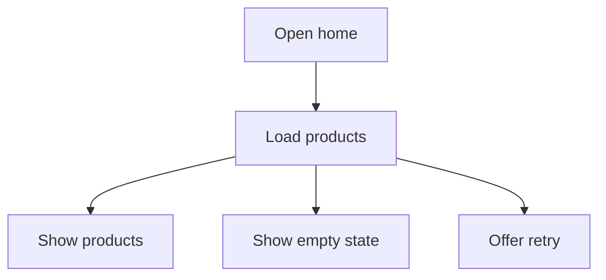

# Storefront Home Flow

```mermaid
flowchart TD
    Open["Open home"] --> Load["Load products"]
    Load --> Success["Show products"]
    Load --> Empty["Show empty state"]
    Load --> Error["Offer retry"]
```

## Changelog

- 1.0.0 (2026-07-30): Initial approved flow.
