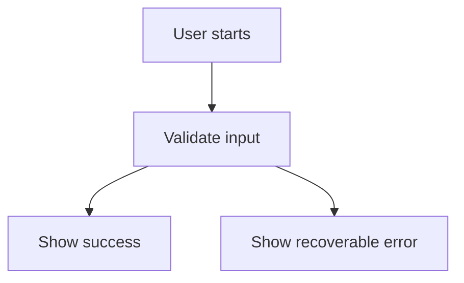

# {{TITLE}} Flow

## Main Flow

## Alternate Flows

- Describe cancellation, retry, permission, and partial-success paths.

## State Ownership

Document which system owns each transition and persisted state.

## Changelog

- 0.1.0 ({{DATE}}): Initial flow.
